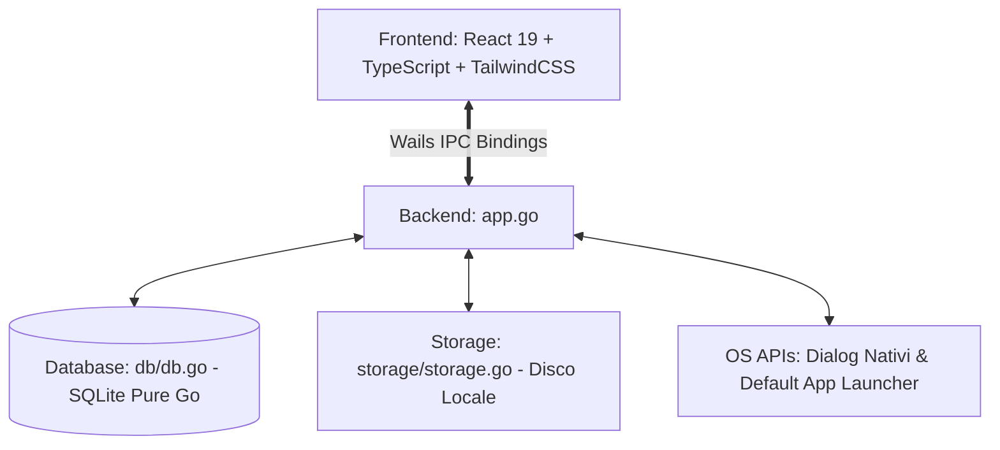

# AGENTS.md - Guida per Sviluppatori e Agenti AI per EduDrive

Repository GitHub: [https://github.com/stiavelli21/EduDrive.git](https://github.com/stiavelli21/EduDrive.git)

Prima di effettuare modifiche o proporre nuove funzionalita, consultare sempre il file [README.md](README.md) per comprendere scopi, funzionalita, stack tecnologico e flussi utente dell'applicazione.

---

## Regole Fondamentali per Agenti AI

1. **Aggiornamento Documentazione**:
   - In caso di modifiche architetturali, nuove funzionalita o cambi strutturali rilevanti, e obbligatorio aggiornare sia questo file (`AGENTS.md`) sia il file (`README.md`).
2. **Commenti nel Codice**:
   - Il codice sorgente (Go, TypeScript, CSS) deve contenere commenti frequenti, chiari e scritti esclusivamente in lingua inglese.
3. **File Markdown (.md)**:
   - Tutti i file di documentazione `.md` devono essere redatti in lingua italiana, con stile sintetico, diretto e privo di emoji.

---

## Architettura dell'Applicazione

EduDrive utilizza Wails v2: backend nativo in Go e frontend web in React + TypeScript + Vite + TailwindCSS. La comunicazione IPC tra Go e Webview e fortemente tipizzata tramite binding generati automaticamente da Wails.

---

## Mappa dei File e Responsabilita

### 1. Backend Go
| File | Responsabilita |
| :--- | :--- |
| [`main.go`](main.go) | Inizializzazione finestra desktop, backdrop Mica, montaggio asset e hook di ciclo di vita (`OnStartup`, `OnShutdown`). |
| [`app.go`](app.go) | Controller centrale esposto a Wails. Metodi esposti: `ListItems`, `GetBreadcrumbs`, `CreateFolder`, `ImportFiles`, `ImportFileByPath`, `SaveFileFromBase64`, `ExportFile`, `OpenFileLocally`, `RenameItem`, `DeleteItem`, `RestoreItem`, `EmptyTrash`, `SearchItems`, `GetStorageStats`, `GetAppStoragePath`. |
| [`models/item.go`](models/item.go) | Strutture dati: `Item` (file e cartelle), `Breadcrumb`, `StorageStats`. |
| [`db/db.go`](db/db.go) | Data access layer SQLite con `modernc.org/sqlite` (Pure Go, no CGO). Gestisce migrazioni schema, query ricorsive per gerarchia cartelle, soft-delete (`is_trash`), ricerca e transazioni sicure. |
| [`storage/storage.go`](storage/storage.go) | Gestore dello storage fisico. Salva file con nomi UUID univoci (`uuid.ext`) in `%APPDATA%/EduDrive/storage_data/`, rileva tipi MIME, effettua copia sicura, esportazione e cancellazione fisica da disco. |

### 2. Frontend React + TypeScript
| Directory / File | Responsabilita |
| :--- | :--- |
| [`frontend/src/App.tsx`](frontend/src/App.tsx) | Coordinatore di stato principale (navigazione cartelle, viste attive, ricerca, notifiche toast, drag-and-drop, gestione modali). |
| [`frontend/src/types/index.ts`](frontend/src/types/index.ts) | Definizioni di tipo (`DriveItem`, `BreadcrumbItem`, `ViewMode`, `LayoutMode`, `ToastMessage`). |
| [`frontend/src/utils/formatters.tsx`](frontend/src/utils/formatters.tsx) | Formattazione byte (`formatBytes`), date (`formatDate`) e resolver icone/colori per estensione file e tipo MIME (`getFileTypeInfo`). |
| [`frontend/src/components/Header.tsx`](frontend/src/components/Header.tsx) | Barra superiore di ricerca, selettore layout (Griglia / Elenco), trigger statistiche storage e refresh. |
| [`frontend/src/components/Sidebar.tsx`](frontend/src/components/Sidebar.tsx) | Dropdown `+ Nuovo` (upload file / nuova cartella), navigazione viste (*Il mio Drive*, *Recenti*, *Cestino*) e indicatore memoria. |
| [`frontend/src/components/Breadcrumbs.tsx`](frontend/src/components/Breadcrumbs.tsx) | Percorso interattivo della gerarchia cartelle (`Il mio Drive > Cartella > Sottocartella`). |
| [`frontend/src/components/GridView.tsx`](frontend/src/components/GridView.tsx) | Layout a schede stile Google Drive per cartelle e file. |
| [`frontend/src/components/ListView.tsx`](frontend/src/components/ListView.tsx) | Vista tabellare per file e cartelle con colonne informative. |
| [`frontend/src/components/ContextMenu.tsx`](frontend/src/components/ContextMenu.tsx) | Menu contestuale flottante tasto destro (Apri, Esporta, Rinomina, Cestino/Ripristina, Elimina definitivo, Dettagli). |
| [`frontend/src/components/DropOverlay.tsx`](frontend/src/components/DropOverlay.tsx) | Overlay visivo per trascinamento file dal desktop di Windows. |
| [`frontend/src/components/ToastContainer.tsx`](frontend/src/components/ToastContainer.tsx) | Stack di notifiche toast non bloccanti. |
| [`frontend/src/components/Modals/`](frontend/src/components/Modals/) | Modali per `NewFolderModal`, `RenameModal`, `ConfirmModal`, `DetailsModal`, `StorageModal`. |
| [`frontend/wailsjs/`](frontend/wailsjs/) | Definizioni TypeScript e proxy JS autogenerati da Wails per i metodi Go. |

---

## Convenzioni Tecniche

1. **SQLite Pure Go (No CGO)**:
   - Utilizzare esclusivamente `modernc.org/sqlite` per garantire compilazione diretta senza toolchain C/GCC o MinGW su Windows.
2. **Separazione Nome Logico e File su Disco**:
   - Il nome originale visibile all'utente risiede in `items.name`.
   - Il file fisico e archiviato come `storage_data/<UUID>.<ext>` per prevenire conflitti o problemi con caratteri non consentiti dal filesystem.
3. **Gerarchia Cartelle**:
   - Per le cartelle: `is_folder = 1` e `storage_path = ''`.
   - `parent_id = NULL` o stringa vuota indica la radice (`Il mio Drive`).
   - Per eliminazione o spostamento nel cestino, propagare ricorsivamente lo stato ai discendenti con `db.GetAllDescendantItems`.
4. **Sincronizzazione Binding Wails**:
   - A ogni modifica o aggiunta di metodi esportati in `app.go`, eseguire `wails generate module` dalla radice del progetto per aggiornare `frontend/wailsjs`.
5. **Testing**:
   - Mantenere aggiornati i test unitari Go in `db/db_test.go` e `storage/storage_test.go`. Eseguire con `go test -v ./...`.