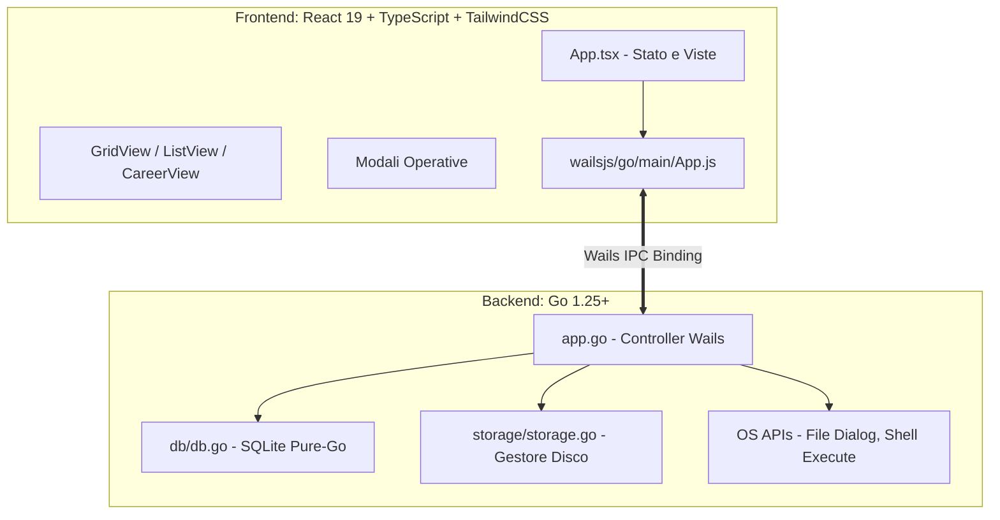

# AGENTS.md - Guida Operativa per Sviluppatori e Agenti AI per EduDrive

Repository GitHub: [https://github.com/stiavelli21/EduDrive.git](https://github.com/stiavelli21/EduDrive.git)

Questo documento e la guida primaria e autoritativa per qualsiasi agente AI o sviluppatore che opera su EduDrive. Tutte le istruzioni, i vincoli tecnici e le convenzioni qui specificati devono essere seguiti rigorosamente.

---

## 1. Panoramica del Progetto

EduDrive e un'applicazione desktop locale per la gestione di file, cartelle e collegamenti web, strutturata come clone moderno di Google Drive, arricchita con strumenti accademici per studenti universitari (gestione scadenze esami e libretto universitario con calcolo della media ponderata).

### Stack Tecnologico
- **Desktop Framework**: Wails v2 (Go nativo + Microsoft WebView2 su Windows).
- **Backend**: Go (1.25+), pattern Controller-Service-Repository.
- **Database**: SQLite Pure-Go (`modernc.org/sqlite`) - zero dipendenze CGO/GCC.
- **Storage Fisico**: Gestore locale su disco basato su UUID in `%APPDATA%/EduDrive/storage_data/`.
- **Frontend**: React 19, TypeScript, Vite, TailwindCSS v3, Lucide React.
- **Comunicazione IPC**: Bindings fortemente tipizzati generati da Wails (`frontend/wailsjs`).

---

## 2. Regole Assolute di Sviluppo (Guardrails)

Ogni agente AI e sviluppatore DEVE rispettare senza eccezioni le seguenti regole:

1. **Commenti nel Codice**:
   - Tutti i commenti nel codice sorgente (Go, TypeScript, CSS, SQL) devono essere frequenti, chiari ed esclusivamente in lingua inglese.
2. **File Markdown (.md)**:
   - Tutta la documentazione in file `.md` deve essere redatta esclusivamente in lingua italiana, con stile asciutto, tecnico, sintetico e privo di qualsiasi emoji.
3. **Aggiornamento Documentazione**:
   - In caso di aggiunta/modifica di funzionalita, modifiche architetturali o cambi strutturali al database o alle API, e obbligatorio aggiornare contestualmente sia questo file (`AGENTS.md`) sia il file (`README.md`).
4. **SQLite Pure-Go (Zero CGO)**:
   - Utilizzare solo ed esclusivamente il driver `modernc.org/sqlite`. E severamente vietato importare `github.com/mattn/go-sqlite3` o qualsiasi libreria che richieda toolchain C/GCC o MinGW per Windows.
5. **Disaccoppiamento tra Nome Logico e File Fisico**:
   - Il nome visualizzato dall'utente e salvato nel DB in `items.name`.
   - Il file fisico e archiviato su disco come `storage_data/<UUID>.<estensione>` per prevenire collisioni e caratteri speciali non validi per il filesystem dell'OS.
   - I collegamenti web hanno `mime_type = 'url'`, `storage_path = '<URL>'` e non occupano file su disco.
6. **Integrita e Cascata della Gerarchia Virtuale**:
   - Le cartelle hanno `is_folder = 1` e `storage_path = ''`.
   - `parent_id = NULL` o stringa vuota indica la cartella radice ("Il mio Drive").
   - Quando una cartella viene spostata nel cestino (`is_trash = 1`), ripristinata (`is_trash = 0`) o eliminata definitivamente, l'operazione deve propagarsi ricorsivamente a tutti i discendenti.
7. **Politica di Cancellazione Fisica**:
   - Il soft-delete (`is_trash = 1`) NON deve mai cancellare file da disco.
   - La cancellazione fisica da disco avviene SOLO tramite eliminazione definitiva (`DeleteItem(..., permanent=true)`) o svuotamento cestino (`EmptyTrash()`).

---

## 3. Architettura dell'Applicazione



### Posizione Dati Runtime
- **Directory base**: `%APPDATA%/EduDrive/` (su Windows) o fallback `./edudrive_data/`.
- **Database SQLite**: `%APPDATA%/EduDrive/edudrive.db`.
- **Cartella Storage File**: `%APPDATA%/EduDrive/storage_data/`.

---

## 4. Mappa dei File e Responsabilita

### 4.1 Backend Go
| File | Responsabilita Principali |
| :--- | :--- |
| [`main.go`](main.go) | Inizializzazione finestra desktop Wails, configurazione backdrop Mica su Windows, montaggio asset frontend e hook di ciclo di vita (`startup`, `shutdown`). |
| [`app.go`](app.go) | Controller centrale esportato a Wails. Espone tutti i metodi richiamabili dal frontend via IPC (CRUD file/cartelle, import/export, lettura/creazione/modifica Markdown, cestino, statistiche storage, scadenze esami, libretto universitario) e gestione dell'inizializzazione dati con seeding automatico di `README.md` incorporato a compile-time via `//go:embed`. |
| [`app_test.go`](app_test.go) | Test unitari per il ciclo di vita e il seeding iniziale dei file di default. |
| [`models/item.go`](models/item.go) | Strutture dati condivise: `Item`, `Breadcrumb`, `StorageStats`, `ExamDate`, `PassedExam`. |
| [`db/db.go`](db/db.go) | Data Access Layer SQLite (pure Go). Gestione tabelle `items`, `exam_dates`, `passed_exams`, `app_settings`, migrazioni automatiche, query ricorsive ad albero, sincronizzazione dimensioni/timestamp, soft-delete, statistiche aggregate e transazioni. |
| [`db/db_test.go`](db/db_test.go) | Suite completa di test unitari per tutte le operazioni sul database SQLite. |
| [`storage/storage.go`](storage/storage.go) | Gestione fisica dei file: salvataggio con UUID, lettura e aggiornamento contenuti testuali/Markdown, esportazione su disco, rilevamento MIME type basato su signature binaria/estensione, eliminazione sicura. |
| [`storage/storage_test.go`](storage/storage_test.go) | Suite di test unitari per il gestore di storage su disco. |

### 4.2 Frontend React + TypeScript
| File / Directory | Responsabilita Principali |
| :--- | :--- |
| [`frontend/src/main.tsx`](frontend/src/main.tsx) | Entry point React con montaggio root in strict mode. |
| [`frontend/src/App.tsx`](frontend/src/App.tsx) | Coordinatore di stato globale: navigazione cartelle, selezione viste, gestione drag-and-drop globale, toast notifications e orchestrazione modali (inclusa apertura e salvataggio documenti Markdown). |
| [`frontend/src/types/index.ts`](frontend/src/types/index.ts) | Tipi e interfacce TypeScript dell'applicazione (`DriveItem`, `BreadcrumbItem`, `StorageStats`, `ExamDateItem`, `PassedExamItem`, `ViewMode`, `LayoutMode`, `ToastMessage`). |
| [`frontend/src/utils/formatters.tsx`](frontend/src/utils/formatters.tsx) | Funzioni helper: `formatBytes` (formattazione dimensioni), `formatDate` (date localizzate), `getFileTypeInfo` (icone e badge per estensione/MIME, con badge dedicato per file Markdown), `getExamUrgencyInfo` (colori e urgenza scadenze). |
| [`frontend/src/style.css`](frontend/src/style.css) | Foglio di stile principale con direttive TailwindCSS, configurazione font, animazioni e scrollbar personalizzate. |
| [`frontend/wailsjs/`](frontend/wailsjs/) | Codice generato da Wails contenente i client JavaScript e le definizioni TypeScript per invocare le funzioni di `app.go`. |

### 4.3 Componenti UI (`frontend/src/components/`)
| Componente | Responsabilita |
| :--- | :--- |
| [`Header.tsx`](frontend/src/components/Header.tsx) | Barra superiore con input di ricerca in tempo reale, toggle vista Griglia/Elenco, apertura statistiche storage e refresh manuale. |
| [`Sidebar.tsx`](frontend/src/components/Sidebar.tsx) | Menu dropdown "+ Nuovo" (cartella, file Markdown, caricamento file, link web), navigazione viste (*Il mio Drive*, *Recenti*, *Cestino*, *Libretto*), widget scadenze esami con indicatore di urgenza e barra utilizzo storage. |

| [`Breadcrumbs.tsx`](frontend/src/components/Breadcrumbs.tsx) | Percorso interattivo di navigazione cartelle ("Il mio Drive > Cartella > Sottocartella") e indicatore contestuale vista attiva. |
| [`GridView.tsx`](frontend/src/components/GridView.tsx) | Layout a schede/griglia in stile Google Drive con sezioni separate per cartelle e file/link. Supporta selezione, doppio clic e menu tasto destro. |
| [`ListView.tsx`](frontend/src/components/ListView.tsx) | Vista tabellare dettagliata con colonne (Nome, Ultima modifica, Dimensione, Tipo) e azioni rapide. |
| [`CareerView.tsx`](frontend/src/components/CareerView.tsx) | Cruscotto completo del Libretto Universitario: calcolo media ponderata, stima voto base di laurea su 110, avanzamento CFU per tipologia di corso (180, 120, 300, 360), simulatore interattivo 'What-If', configurazione peso lode e tabella esami con ricerca/filtri. |
| [`ContextMenu.tsx`](frontend/src/components/ContextMenu.tsx) | Menu contestuale al clic col tasto destro: Apri / Leggi in EduDrive, Apri con app di sistema, Esporta, Rinomina, Dettagli, Sposta nel Cestino, Ripristina, Elimina Definitivo. |
| [`DropOverlay.tsx`](frontend/src/components/DropOverlay.tsx) | Overlay visivo per drag-and-drop di file da Esplora Risorse di Windows. |
| [`ToastContainer.tsx`](frontend/src/components/ToastContainer.tsx) | Contenitore flottante per notifiche toast non bloccanti (successo, errore, avviso, info). |

### 4.4 Modali (`frontend/src/components/Modals/`)
| Modale | Scopo |
| :--- | :--- |
| [`MarkdownModal.tsx`](frontend/src/components/Modals/MarkdownModal.tsx) | Visualizzatore, lettore ed editor Markdown integrato con supporto anteprima live/split view, toolbar di formattazione rapida GFM, conteggio parole/tempo di lettura e salvataggio in-app. |
| [`NewFolderModal.tsx`](frontend/src/components/Modals/NewFolderModal.tsx) | Creazione di nuove cartelle virtuali nella posizione corrente. |
| [`NewLinkModal.tsx`](frontend/src/components/Modals/NewLinkModal.tsx) | Creazione di collegamenti web / segnalibri con prefisso automatico HTTPS. |
| [`NewExamModal.tsx`](frontend/src/components/Modals/NewExamModal.tsx) | Inserimento di nuove date di appelli d'esame con data picker. |
| [`PassedExamModal.tsx`](frontend/src/components/Modals/PassedExamModal.tsx) | Creazione e modifica esami superati nel Libretto (materia, voto 18-30, lode, CFU, data). |
| [`RenameModal.tsx`](frontend/src/components/Modals/RenameModal.tsx) | Ridenominazione di file, cartelle e collegamenti web. |
| [`ConfirmModal.tsx`](frontend/src/components/Modals/ConfirmModal.tsx) | Conferma sicura per azioni distruttive (svuota cestino, eliminazione definitiva). |
| [`DetailsModal.tsx`](frontend/src/components/Modals/DetailsModal.tsx) | Scheda informativa su metadati, percorso, dimensione esatta, date e MIME type dell'elemento. |
| [`StorageModal.tsx`](frontend/src/components/Modals/StorageModal.tsx) | Visualizzazione analitica dello storage (file attivi, cestino, conteggi, spazio su disco e percorso dati). |


---

## 5. Logica di Dominio e Formule di Calcolo

### 5.1 Libretto Universitario (`CareerView.tsx`)
- **Media Ponderata**:
  $$\text{Media Ponderata} = \frac{\sum (\text{VotoEffettivo}_i \times \text{CFU}_i)}{\sum \text{CFU}_i}$$
  *Se lode (`is_honors = true`), il voto effettivo e definito dall'impostazione utente: 30 (standard), 31 o 33.*
- **Voto Base di Partenza per la Laurea**:
  $$\text{Base Laurea (su 110)} = \frac{\text{Media Ponderata} \times 110}{30}$$
- **Simulatore What-If**:
  Calcola l'impatto ipotetico sulla media e sulla base di laurea di uno o piu esami futuri prima di registrarli.
- **Obiettivi CFU**:
  - Triennale: 180 CFU
  - Magistrale: 120 CFU
  - Ciclo Unico: 300 o 360 CFU

### 5.2 Scadenze Esami (`ExamDate` e `getExamUrgencyInfo`)
- Differenza in giorni tra data odierna e data dell'appello:
  - **Urgente (Rosso)**: $\le 10$ giorni rimanenti o data gia trascorsa.
  - **Medio (Giallo)**: tra 11 e 30 giorni rimanenti.
  - **Tranquillo (Verde)**: $> 30$ giorni rimanenti.

---

## 6. Playbook Operativo per Agenti AI

Quando un agente AI deve implementare una modifica su EduDrive, deve seguire queste procedure:

### Procedura 1: Aggiunta o Modifica di un'API Backend
1. Se necessario, aggiornare le strutture dati in `models/item.go`.
2. Implementare la logica database in `db/db.go` con query sicure e parametrizzate.
3. Se coinvolge file fisici, aggiornare `storage/storage.go`.
4. Esporre o aggiornare il metodo nel controller `app.go` su `App`.
5. Aggiungere i test corrispondenti in `db/db_test.go` o `storage/storage_test.go`.
6. Eseguire i test con `go test -v ./...`.
7. Aggiornare i binding in `frontend/wailsjs/go/main/App.js` e `App.d.ts` o eseguire `wails generate module`.
8. Integrare il metodo nel frontend React con gestione errori e toast notifications.

### Procedura 2: Modifica dello Schema Database SQLite
1. In `db/db.go`, modificare la funzione `migrate()` aggiungendo query `CREATE TABLE IF NOT EXISTS` o `ALTER TABLE` compatibili con versioni esistenti del database.
2. Mantenere l'uso esclusivo di `modernc.org/sqlite`.
3. Verificare l'esecuzione dei test unitari (`go test -v ./...`).

### Procedura 3: Aggiunta di Componenti UI o Modali
1. Creare il componente in `frontend/src/components/` o `frontend/src/components/Modals/`.
2. Utilizzare TailwindCSS per lo stile, mantenendo la coerenza grafica con il resto dell'applicazione.
3. Utilizzare icone da `lucide-react`.
4. Scrivere tutti i commenti TypeScript in lingua inglese.
5. Verificare la compilazione frontend con `npm run build` all'interno della cartella `frontend`.

---

## 7. Comandi di Sviluppo, Test e Verifica

### Test Backend Go
Eseguire tutti i test unitari del backend:
```bash
go test -v ./...
```

### Verifica e Build del Frontend
Dalla cartella `frontend`:
```bash
cd frontend
npm run build
```

### Esecuzione Desktop in Sviluppo (Hot Reload)
```bash
wails dev
```

### Compilazione Produzione Eseguibile (.exe)
```bash
wails build
```
L'eseguibile compilato viene generato in `build/bin/EduDrive.exe`.

---

## 8. Anti-Pattern e Azioni Vietate

- **NON** importare `mattn/go-sqlite3` o altri pacchetti CGO.
- **NON** salvare file su disco con il nome utente originale; utilizzare sempre UUID.
- **NON** cancellare fisicamente i file dal disco quando un elemento viene spostato nel cestino (`is_trash = 1`).
- **NON** inserire emoji nei file di documentazione `.md`.
- **NON** scrivere commenti nel codice sorgente in lingue diverse dall'inglese.
- **NON** dimenticare di aggiornare sia `AGENTS.md` sia `README.md` quando si modificano funzionalita o strutture dati.