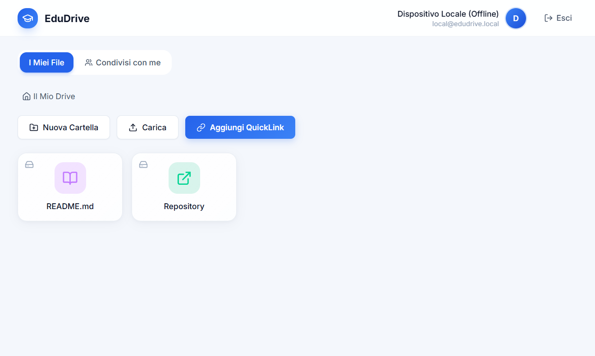

# EduDrive

> **Il cloud storage open source fatto dagli studenti, per gli studenti.**
> Condividi appunti, organizza documenti e salva risorse esterne in un unico spazio di studio collaborativo.



---

## Perché EduDrive? (Punti di Forza)

- **Interfaccia Light & Blue**: Design moderno, luminoso e pulito per un'esperienza di studio senza distrazioni.
- **Accesso Ibrido: Google Auth Online o Modalità Locale Offline 100%**: Entra in un clic tramite **Firebase Auth** importando automaticamente Nome e Foto Profilo ufficiale dal tuo account Google o universitario, oppure accedi istantaneamente in **Modalità Locale Offline** (senza account, senza credenziali e persino senza connessione a internet) trasformando il tuo dispositivo nel server di archiviazione principale.
- **Spostamento Rapido dei File tra Cloud e Locale**: Nella vista unificata, i file memorizzati in locale e quelli nel cloud convivono con indicatori visivi distinti ("Locale" e "Server"). Con un semplice clic puoi spostare la memorizzazione fisica di un file dal cloud al tuo hard disk locale e viceversa.
- **Avvio Istantaneo su PC con `avvia.bat`**: Grazie allo script di automazione `avvia.bat` nella cartella principale, puoi avviare l'applicazione in modalità locale e standalone senza dover generare preventivamente il file `.exe`. Lo script accende e verifica in automatico il motore Docker (avviando Docker Desktop se spento) e apre direttamente l'interfaccia collegata ai tuoi file locali.
- **QuickLink Integrati**: Salva link esterni (Google Drive, YouTube, Dropbox) direttamente come cartelle o file cliccabili nel tuo cloud. Mai più file `.txt` con link incollati!
- **Conversione Testuale Intelligente (.md & Convertitore alla Rovescia)**: Ogni file di testo caricato (`.docx`, `.doc`, `.txt`, `.html`, `.rtf`) viene automaticamente tradotto in un pulito formato **Markdown (.md)** mantenendo intatte evidenziazioni gialle, titoli e stili. E quando scarichi un file `.md`, puoi scegliere in quale formato esportarlo (`.md`, `.docx` o `.txt`) col nostro convertitore alla rovescia!
- **Gestione Quota e Monitoraggio Memoria**: Ogni utente ha un limite di archiviazione predefinito di **500 MB** (personalizzabile individualmente a database per futuri upscaling). Cliccando sulla propria icona profilo si apre la modale di dettaglio con barra di progresso colorata, memoria utilizzata al byte e percentuale occupata.
- **Condivisione Granulare**: Condividi cartelle con compagni specifici via email o con il loro `@username` scegliendo i permessi (*Lettore* o *Editore*), oppure rendile pubbliche con un clic.
- **Sicurezza e Performance**: Autenticazione con OAuth Google e JWT (Access & Refresh Token) su archiviazione veloce compatibile con S3.
- **100% Modulare per Studenti Sviluppatori**: Struttura pensata per creare e integrare nuovi plugin didattici in pochi minuti.

---

## Stack Tecnologico

| Componente | Tecnologia |
|---|---|
| **Frontend** | React 18 + Vite + Tailwind CSS v4 (Tema Light & Blue) + Firebase Auth |
| **Desktop App & Standalone** | Tauri v2 (Rust + WebView2) e Launcher Standalone (`open-app.js`) |
| **Backend** | Node.js + Express (REST API modulari con verifica Google ID, JWT e supporto Offline) |
| **Database** | PostgreSQL locale (Docker) o Cloud Serverless + Drizzle ORM |
| **Storage** | Object Storage S3 compatibile (es. MinIO locale) + Hard Disk Locale |

---

## Guida all'Avvio e Sviluppo (Per Amici e Collaboratori)

Se hai scaricato il codice da GitHub o vuoi provare l'applicazione sul tuo computer, devi sapere che il file `.exe` di EduDrive comunica con un server (locale o in Cloud). Per questo motivo, il comportamento dipende da come configuri le variabili d'ambiente prima di compilarlo o avviarlo.

### Prerequisiti
- **Node.js** (v18+)
- **Docker & Docker Compose** (necessari solo per avviare database e storage sul tuo PC in modalità locale 100%)
- *(Opzionale per App Nativa)* **Rust & C++ Build Tools** (per compilare il file `.exe` con `build.bat` su Windows)

---

### Come provare o compilare EduDrive scaricato da GitHub

Ci sono **tre modalità principali** con cui puoi provare l'applicazione sul tuo computer:

#### Modalità 0 (Novità): Avvio Rapido Locale con `avvia.bat` (Senza compilare il `.exe`)
Se vuoi utilizzare l'applicazione sul tuo PC in modalità offline collegandoti direttamente all'hard disk locale senza passare dalla schermata di login e senza necessità di un utente online:
1. Assicurati di aver installato **Node.js** e **Docker Desktop**.
2. Fai doppio clic sul file **`avvia.bat`** presente nella cartella principale del progetto.
3. Lo script verificherà se Docker è attivo (o lo avvierà in automatico se spento), lancerà i contenitori locali e aprirà subito l'applicazione in modalità standalone locale, collegata direttamente ai file del tuo dispositivo.

#### Modalità 1: Compilare l'App (.exe) connessa al Cloud Online (Per provare l'app come utente)
Se l'autore del progetto ha già pubblicato il server sul Cloud (es. su Render.com) e vuoi generare un `.exe` che funzioni subito sul tuo PC senza dover avviare un server locale:
1. Clona o scarica il repository:
   ```bash
   git clone https://github.com/stiavelli21/EduDrive.git
   cd EduDrive
   ```
2. Crea un file chiamato `.env` dentro la cartella `frontend/` copiando il modello di esempio:
   ```bash
   cp frontend/.env.example frontend/.env
   ```
3. Apri il file `frontend/.env` e inserisci l'indirizzo delle API online (es. `VITE_API_URL=https://tuo-servizio.onrender.com/api`) e le chiavi di Firebase per l'accesso Google (`VITE_FIREBASE_*`).
   *(Nota bene: se salti questo passaggio o compili senza il file `.env`, l'app punterà di default a `http://localhost:3001/api`. Di conseguenza, se sul tuo PC non c'è un server attivo su quella porta, l'app rimarrà bloccata nella schermata di caricamento all'infinito!)*
4. Fai doppio clic su `build.bat` su Windows (o esegui `npm run build:desktop`). Il sistema compilerà il file `.exe` autonomo includendo al suo interno l'URL del Cloud, salvandolo in:
   `frontend/src-tauri/target/release/bundle/nsis/` (oppure `app.exe` in `frontend/src-tauri/target/release/`).

#### Modalità 2: Avviare l'intero Stack 100% in Locale (Per sviluppatori che vogliono server e database sul proprio PC)
Se invece vuoi far girare sia il server Node.js che l'applicazione interamente sul tuo computer:
1. Clona il repository e installa tutte le dipendenze:
   ```bash
   git clone https://github.com/stiavelli21/EduDrive.git
   cd EduDrive
   npm install
   ```
2. Configura il backend creando il file `backend/.env` (puoi copiarlo da `backend/.env.example`):
   ```bash
   cp backend/.env.example backend/.env
   ```
3. Avvia il database locale con Docker ed esegui i servizi:
   - Per avviare contemporaneamente il **Backend Node.js locale** e l'**App Desktop Tauri** connessa a `localhost:3001`:
     ```bash
     npm run start:desktop
     ```
   - Per avviare invece il **Backend** e l'interfaccia **Web nel browser** (`localhost:5173`):
     ```bash
     npm run dev
     ```

---

### Creare e trovare i file Desktop (`app.exe` e Installer)
Per generare l'eseguibile di produzione per Windows (dopo aver configurato `frontend/.env` per il cloud o per il locale):
```bash
npm run build:desktop
```
*(Oppure fai doppio clic su `build.bat`)*

Al termine della compilazione troverai due tipi di file:
- **Eseguibile Diretto (`app.exe`)**: in `frontend/src-tauri/target/release/app.exe` (il binario pronto all'esecuzione immediata).
- **Installer Setup (`.exe`)**: in `frontend/src-tauri/target/release/bundle/nsis/EduDrive_0.1.0_x64-setup.exe` (il classico programma di installazione per Windows).

---

### 5. Autenticazione Esclusiva con Google Auth & Nome Utente
EduDrive offre agli studenti l'accesso istantaneo, protetto e moderno ad un clic tramite il pulsante **"Accedi con Google / Continua con Google"**, alimentato da **Firebase Authentication**:
- **Zero Password Classiche**: Per garantire la massima sicurezza e semplicità, la classica modalità di registrazione ed accesso con email/password è stata rimossa, adottando un flusso 100% Google-driven.
- **Nome Utente Personalizzato (@username)**: Oltre al Nome Visualizzato e alla foto profilo estratti dall'account Google, ogni studente può definire dalla modale del profilo il proprio **Nome Utente (@username)** univoco (da 3 a 50 caratteri), utile per farsi identificare facilmente nel workspace e nelle condivisioni cartelle.
- **Su Web Browser**: Utilizza il popup nativo e immediato (`signInWithPopup`) per completare l'accesso in frazioni di secondo senza ricaricare la pagina.
- **Su App Desktop Windows (`.exe` Tauri WebView2)**: Se il popup viene bloccato dalle protezioni del sistema operativo o della WebView, l'app attiva il **fallback automatico al reindirizzamento (`signInWithRedirect`)**, avvalendosi di un listener in tempo reale (`onAuthStateChanged`) per ripristinare e loggare l'utente nel cloud al momento del rientro nell'applicazione.
- **Sicurezza Backend**: I token JWT di Google vengono validati crittograficamente sul backend Node.js (`POST /api/auth/google`), associando automaticamente la sessione e lo username alla tabella `users` di PostgreSQL.

---

## Come funzionano i QuickLink?

1. Clicca su **"Aggiungi QuickLink"** nella dashboard.
2. Inserisci un titolo e l'URL esterno (es. una dispensa su Google Drive).
3. Il link appare nell'albero dei file come un vero e proprio documento di collegamento.
4. Con un clic si apre direttamente nella risorsa esterna!

---

## Sviluppa il tuo Primo Plugin!

EduDrive è progettato per essere espanso facilmente dagli studenti. Per aggiungere una nuova funzionalità al backend bastano 3 passi:

1. Crea la rotta: `backend/src/routes/tuo-plugin.routes.js`
2. Crea il controller: `backend/src/controllers/tuo-plugin.controller.js`
3. Registra la rotta in `backend/src/app.js`:
   ```javascript
   import pluginRoutes from './routes/tuo-plugin.routes.js';
   app.use('/api/tuo-plugin', pluginRoutes);
   ```

**Cerchi ispirazione per un plugin?** Leggi [IDEE.md](./docs/IDEE.md) per scoprire proposte pronte per essere sviluppate!

---

## Documentazione & Linee Guida AI

- **[ARCHITECTURE.md](./docs/ARCHITECTURE.md)**: Mappa strutturale e flusso dei dati dell'applicazione.
- **[.agents/AGENTS.md](./.agents/AGENTS.md)**: Regole per assistenti AI, convenzioni sullo stile del codice e filosofia UI (Design system `index.css` ed estetica intuitiva essenziale).
- **Divieto Assoluto di Emoji (Zero Emoji Policy)**: È rigorosamente vietato agli assistenti AI inserire emoji all'interno del codice sorgente, dei commenti, dei messaggi di commit e di **qualsiasi file di documentazione `.md`** (`README.md`, `docs/ARCHITECTURE.md`, `docs/IDEE.md`, ecc.), salvo esplicita richiesta contraria dell'utente.

---

## Licenza

**MIT License** — Progetto open source libero, creato da studenti per gli studenti.
